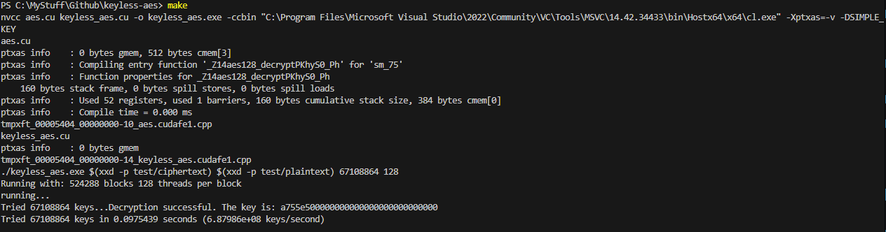
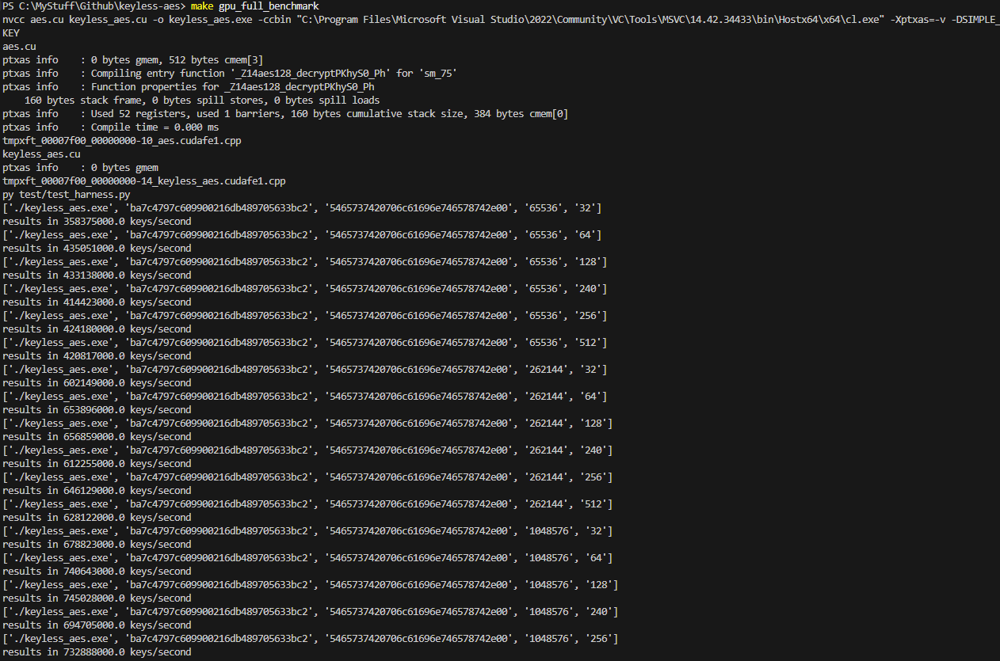
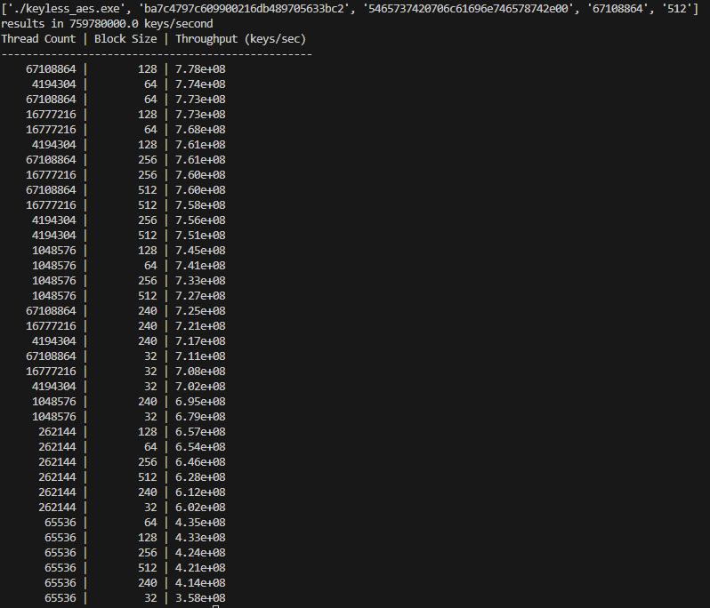
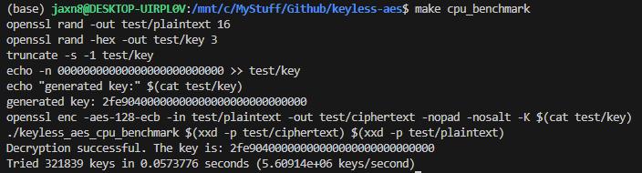
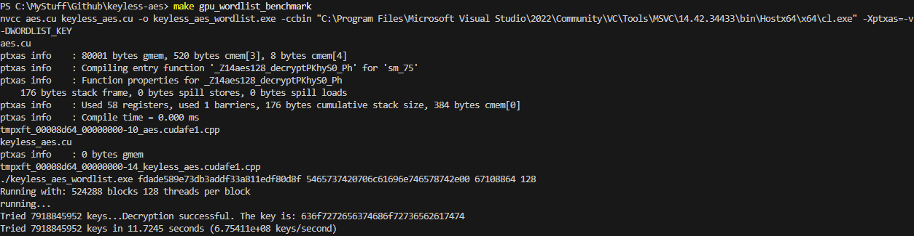

What:

This project attempts to recover an AES128 key given a ciphertext / plaintext pair by repeatedly guessing keys.

Exactly one key will cause the ciphertext to decrypt to the plaintext.
Finding that key is infeasible if it been generated in a cryptographically strong way (generally, randomly), as the entire 2 ^ 128 keyspace must be searched.
If instead you allow a user to choose a password and generate an AES key based on it, standard password-guessing techniques can be applied to reduce the keyspace searched.

The standard defensive technique used to prevent this attack is to run the user-entered password through a hashing algorithm a few hundred thousand times before using it as a key.
It's easy enough to imagine a tool which might skip that though.

How to run:

Requires nvcc - and has no other dependencies. I've tried to get the makerules to work on both linux + windows,
but if it doesn't work out of the box you might need to define CXX for your platform.

run 'make'. This will build the gpu-accelerated aes decryptor 'keyless_aes.exe' and run a simple test using the example ciphertext and plaintext.
You can verify that the produced key matches the real one. This should look something like:

For a more complete test that runs across a number of thread counts and block sizes, run 
'make gpu_full_benchmark' 

This will produce a list of thread count and block size combinations sorted by throughput. An example from running on an RTX 3060 is below.

...

For comparison, the repository also contains an openssl-based CPU implementation that can be built and ran on linux only with
'make cpu_benchmark' - this, of course, will require openssl devel headers to be installed on your system.
On a Ryzen 7 5800X, this benchmark outputs:

Finally, I also implemented a more interesting key guessing scheme - the previous ones all just count up from 0.
You can test that by running `make gpu_wordlist_benchmark`, which compile the same aes decryption source code but with key generation defined 
to be the concatenation of three of the most common english words. Then, it'll run that keyguesser with a hard-coded ciphertext / plaintext pair
that was generated with the key 'correcthorsebatt' - output should look like the below:

Note that this is slightly slower than the best result for gpu_full_benchmark, as this key generation mechanism is slower.

Notes:

https://csrc.nist.gov/CSRC/media/Projects/Cryptographic-Standards-and-Guidelines/documents/examples/AES_Core128.pdf
is an incredibly helpful resource for implementing AES, as it goes step-by-step through the decryption & encryption process

I used NSight Compute to profile my code & get an idea of where I could find the most time - it's really quite good.

My 3060 makes a fun little whistling noise while running the benchmark. It's somewhat concerning, actually...